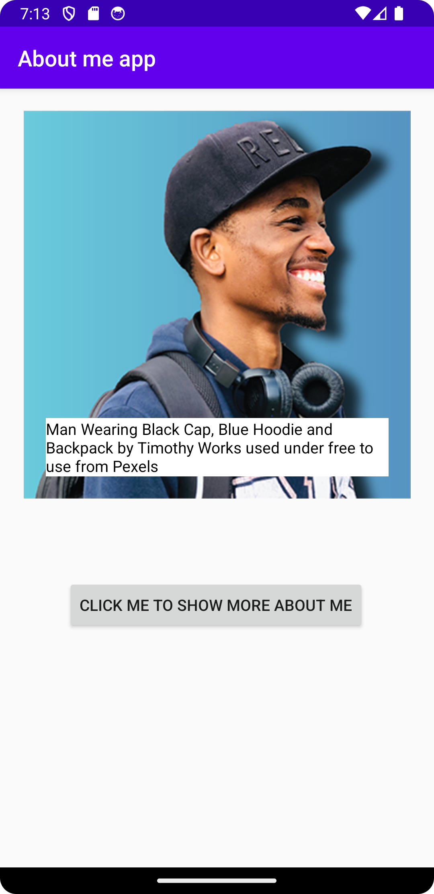

# Rapport

**About me app!**

```
<?xml version="1.0" encoding="utf-8"?>
<androidx.constraintlayout.widget.ConstraintLayout xmlns:android="http://schemas.android.com/apk/res/android"
    ...>

    <ImageView
        android:id="@+id/imageViewProfile"
        ...
        android:layout_margin="20dp"
        ... />

    <TextView
        android:id="@+id/textViewCaption"
        ...
        android:layout_margin="20dp"
        ... />

    <TextView
        android:id="@+id/TextViewAboutMe"
        ...
        android:layout_margin="20dp"
        .../>

    <Button
        android:id="@+id/button"
        ...
        android:layout_margin="20dp"
        ... />


</androidx.constraintlayout.widget.ConstraintLayout>
```
Ovanför koden la jag först till en ConstraintLayout, vilket innebär att alla element kommer att vara sitter fast på layouten. 
Inuti den har jag lagt till två TextView, en ImageView och en Button i filen activity_main.xml.
Varje element har en margin på 20dp för att skapa utrymme mellan dem.

```
...
<ImageView
        android:id="@+id/imageViewProfile"
        android:layout_width="350dp"
        android:layout_height="350dp"
        android:layout_margin="20dp"
        android:contentDescription="@string/profile_description"
        app:layout_constraintEnd_toEndOf="parent"
        app:layout_constraintStart_toStartOf="parent"
        app:layout_constraintTop_toTopOf="parent"
        app:srcCompat="@drawable/persona2"
        tools:srcCompat="@drawable/persona2" />
...
```
Mitt plan var att skapa en profil-app som innehåller en bild av en person för att visa hur den personen ser ut som kan visas . 
För att implementera detta skapade jag en ImageView med en bild kallad "persona2", som har en bredd och höjd på 350dp. 
För att länka bilden använde jag "srcCompat" och lade först till bilden i mappen "drawable". Detta resulterade i att bilden visas i appen.

```
...
<TextView
        android:id="@+id/textViewCaption"
        android:layout_width="0dp"
        android:layout_height="wrap_content"
        android:layout_margin="20dp"
        android:background="#FFFFFF"
        android:text="@string/caption"
        android:textColor="#000000"
        android:textSize="14sp"
        app:layout_constraintBottom_toBottomOf="@+id/imageViewProfile"
        app:layout_constraintEnd_toEndOf="@+id/imageViewProfile"
        app:layout_constraintStart_toStartOf="@+id/imageViewProfile" />
...
```
På bilden som togs från nätet och måste lägga till en bildtext (caption) med hjälp av ett TextView-element. 
Jag använde layout_constraint för att placera texten ovanpå bilden.

Licensinformation:
[Man Wearing Black Cap, Blue Hoodie and Backpack](https://www.pexels.com/photo/man-wearing-black-cap-blue-hoodie-and-backpack-2826131/) 
by [Timothy Works](https://www.pexels.com/@timothypictures/) used under [free to use](https://www.pexels.com/license/) from [Pexels](https://www.pexels.com/).

```
...
<TextView
        android:id="@+id/TextViewAboutMe"
        android:layout_width="wrap_content"
        android:layout_height="wrap_content"
        android:layout_margin="20dp"
        android:text=""
        android:textColor="#000000"
        android:textSize="24sp"
        app:layout_constraintEnd_toEndOf="@+id/imageViewProfile"
        app:layout_constraintStart_toStartOf="@+id/imageViewProfile"
        app:layout_constraintTop_toBottomOf="@+id/imageViewProfile" />
...
```
När appen startar kommer TextView-elementet inte att visa någon text eftersom android:text-attributet är tomt. Detta kommer att berätta senare för att visa texten.

```
...
<Button
        android:id="@+id/button"
        android:layout_width="wrap_content"
        android:layout_height="wrap_content"
        android:layout_margin="20dp"
        android:layout_marginTop="64dp"
        android:text="@string/button_text"
        app:layout_constraintEnd_toEndOf="@+id/TextViewAboutMe"
        app:layout_constraintHorizontal_bias="0.503"
        app:layout_constraintStart_toStartOf="@+id/TextViewAboutMe"
        app:layout_constraintTop_toBottomOf="@+id/TextViewAboutMe" />
...
```
Ovanför koden skapas en knapp med en text.

```
...
// created a button
Button button = findViewById(R.id.button);

// listening if user click a button
button.setOnClickListener( new View.OnClickListener() {
    // when user pressed onclick
    public void onClick(View v) {
        // add text in textview
        TextView textView = findViewById(R.id.TextViewAboutMe);
        textView.setText(R.string.aboutMe);
    }
});
...
```
Ovanför koden i MainActivity.java-filen skapas en knapp och finns en funktion för att lyssna om användaren har klickat på knappen. 
När knappen klickas kommer texten i TextView-elementet (android:text) att uppdateras med en string från strings.xml-filen, vilket resulterar i att texten visas.



Så här ser ut resultatet på appen.


Så här ser ut när knappen har klickats.

## Fördelar
- Appen är snabb och enkel eftersom den inte har många element. 
- Appen passar för användare som inte vet mycket om teknik.
- Appen är gratis, vilket innebär att ladda ner direkt från min kod.

## Nackdelar
- Appen är en prototyp, vilket innebär att den kan ha problem som krascher eller programfrysningar.
- Appen är grundläggande och har inte många funktioner, men kommer att förstätta utvecklas.
- Appen uppdaters långsamt eftersom jag är ensam om att utveckla appen.

- Boulos, M.N.K., Warren, J., Gong, J. & Yue, P. (2010) Web GIS in practice VIII: HTML5 and the canvas element for interactive online mapping. International journal of health geographics 9, 14. Shin, Y. &
- Wunsche, B.C. (2013) A smartphone-based golf simulation exercise game for supporting arthritis patients. 2013 28th International Conference of Image and Vision Computing New Zealand (IVCNZ), IEEE, pp. 459–464.
- Wohlin, C., Runeson, P., Höst, M., Ohlsson, M.C., Regnell, B., Wesslén, A. (2012) Experimentation in Software Engineering, Berlin, Heidelberg: Springer Berlin Heidelberg.
